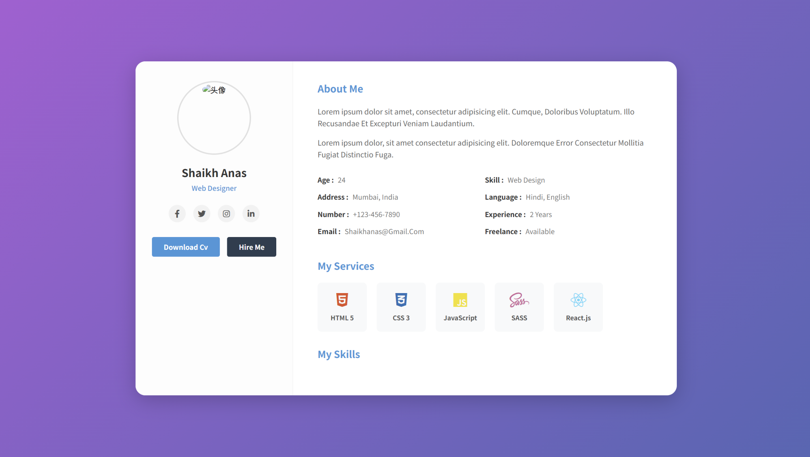
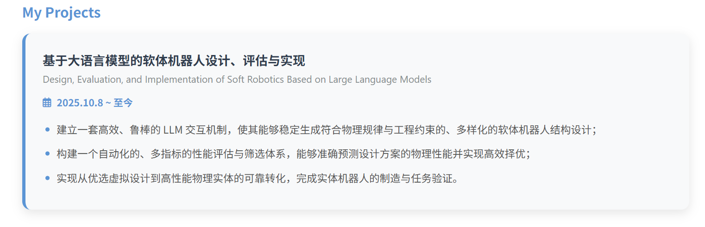

# 工作记录 - 张满羿

> 📌 **说明**：请按照本模板填写你的工作记录。保持格式统一，方便检查

## 👤 个人信息

| 项目 | 内容 |
|------|------|
| **姓名** | 张满羿 |
| **学号** | PB24000051 |
| **GitHub 用户名** | Antimerry |
| **Github 邮箱** | zhangmanyi_mine@163.com |

## 📅 完成记录

### 阶段一

#### 2026-1-26
- **完成任务**：完成了环境的配置
- **估计完成时间**：2小时
- **备注**：无

#### 2026-1-27
- **完成任务**：理解了html的语法结构，学会了html的使用
- **估计完成时间**：4小时
- **备注**：无

#### 2026-1-28
- **完成任务**：学会了如何使用css修饰网页
- **估计完成时间**：4小时
- **备注**：无

#### 2026-1-29
- **完成任务**：学会了flexbox的基本使用，了解了响应式网页的基本要素
- **估计完成时间**：4+1小时
- **备注**：Flexbox Froggy好玩捏

#### 2026-1-31
- **完成任务**：使用html+css书写网页版个人简历，学习git与GitHub的使用
- **估计完成时间**：6+3小时
- **相关链接**：
  - [GitHub 仓库](https://github.com/Antimerry/web-training-2026)
  - [个人简历链接](https://antimerry.github.io/web-training-2026/phase1-static/)
  - [设计参考链接_1](https://www.bilibili.com/video/BV1yP4y137wg/?vd_source=e364c6cbbf1cb2aec29fe95294ed052c)
  - [设计参考链接_2](https://www.bilibili.com/video/BV1rz4y1e7wR/?vd_source=e364c6cbbf1cb2aec29fe95294ed052c)
- **备注**：Gemini太聪明了

#### 关于ai的使用
- 我首先直接把参考成品的截图发给ai，让他照着写一份；第一遍他就会把大致的结构和风格体现出来，接下来再返工两三遍把细节打磨一下。

ai首次做出的网页：


- 对于新添的模块，我会先按照最简单的方式修改html，然后让ai按照网页整体风格为新模块设计CSS样式。示例如下：

ai设计前：

ai设计后：


---

### 阶段二

### 阶段三

---

## 🎯 当前任务
- [ ] 完成个人主页设计
- [ ] 完成个人主页代码
- [ ] （等等，请自行修改）

---

## 📝 工作笔记

### 遇到的问题与解决方案

#### 问题1：跨域请求失败
- **描述**：前端请求后端API时出现CORS错误
- **解决方案**：在后端添加CORS中间件配置
- **参考资料**：[CORS文档](https://...)

#### 问题2：性能优化
- **描述**：页面加载速度慢
- **解决方案**：使用懒加载和代码分割
- **效果**：加载时间从5s降到2s

（按需填写，方便自己回顾，不做强制要求）

---

## 📎 附件

如需添加图片或文件，请在你的目录下创建 `images/` 或 `files/` 文件夹：

```
members/zhangsan/
├── work-log.md
├── images/
│   ├── screenshot1.png
│   └── diagram.png
└── files/
    └── report.pdf
```

然后在文档中引用：
```markdown

[下载报告](files/report.pdf)
```
